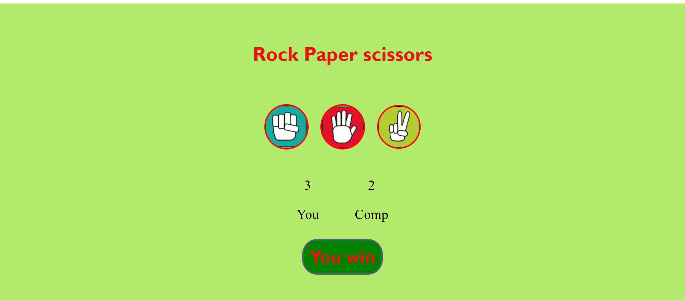
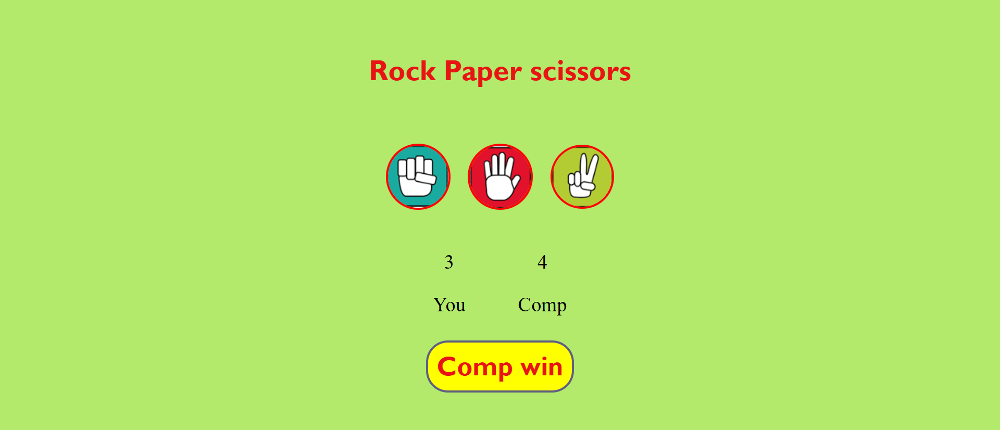
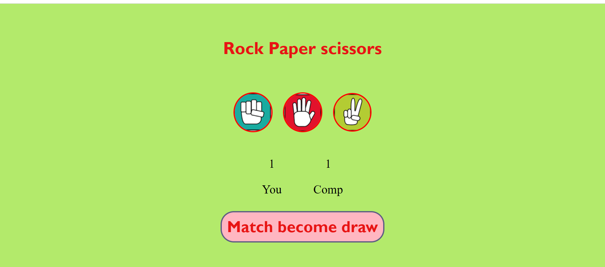

# Rock-Paper-Scissors Game 🎮

A fun and interactive Rock-Paper-Scissors game where you play against the computer. The project is built using  **HTML**, **CSS**, and **JavaScript**. The game keeps track of the total score, displays the winner of each round, and handles ties with a "Match Draw" message.

---

## Features
- **User vs Computer Gameplay**: Choose Rock, Paper, or Scissors and compete against the computer's random choice.
- **Dynamic Result Display**: Shows if the user or computer wins each round, or if it’s a draw.
- **Score Tracking**: Displays the total score for the user and the computer during the session.
- **Interactive UI**: Engaging design built with HTML, CSS, and JavaScript for smooth gameplay.

---

## How It Works
1. **User's Turn**: Click on your choice - Rock, Paper, or Scissors.
2. **Computer's Turn**: The computer randomly picks Rock, Paper, or Scissors.
3. **Result Display**:
   - If the user wins, a message "User Wins" is displayed.
   - If the computer wins, a message "Computer Wins" is displayed.
   - If it's a tie, a message "Match Draw" is displayed.
4. **Score Update**: The total score for both the user and the computer is updated in real-time.

---

## Installation & Usage
1. Clone this repository  to your local machine

